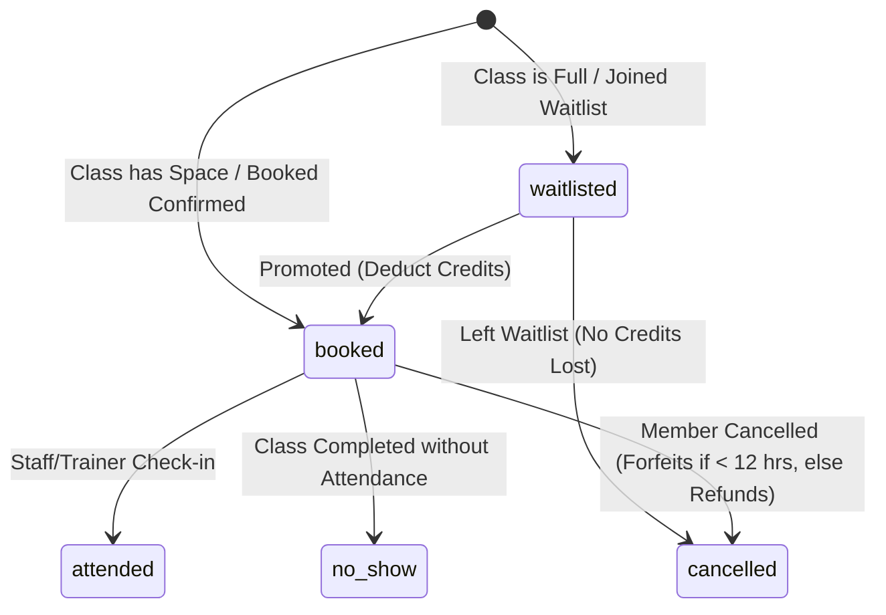

# FlexFit Studio Documentation

This document explains the core roles, processes, lifecycles, and architecture configurations implemented in FlexFit Studio.

---

## 1. Role-Based Permissions

We enforce strict role-based access controls (RBAC) both on the client and secure tRPC procedures server-side:

| Capability | Member | Trainer | Staff | Admin |
|---|---|---|---|---|
| **View schedule** | Yes | Yes | Yes | Yes |
| **Book classes** | Yes | No | No | No |
| **Cancel own booking** | Yes | Yes | Yes | Yes |
| **Reschedule own booking** | Yes | Yes | Yes | Yes |
| **Create classes** | No | Own | Yes | Yes |
| **Assign another trainer** | No | No | Yes | Yes |
| **Cancel any class** | No | No | Yes | Yes |
| **Mark attendance** | No | Yes | Yes | Yes |
| **Manage memberships** | No | No | Yes | Yes |
| **Manage trainers** | No | No | Yes | Yes |
| **View reports** | No | No | Yes | Yes |

* **Server-Side Enforcement**: All mutations check `ctx.user.role` or `ctx.user.id` to reject unauthorized API requests (e.g. trainers attempting to reschedule classes for other trainers).

---

## 2. Booking Lifecycle

Bookings follow a state machine representing the physical slot occupancy and credits:

---

## 3. Waitlist Queue & Promotion

* **Deterministic Queue Order**: Waitlisted candidates are stored in chronological order (`bookedAt` timestamp).
* **Unified Promotion**: When a slot is freed in a class (due to rescheduling or cancellation), the system queries both `bookings` and `corporateBookings` waitlists combined, sorting them chronologically.
* **Eligibility Check**: Before promotion, the system validates the candidate's active membership, expiration bounds, and credit balances. If ineligible, the candidate is skipped and the next queue item is evaluated.

---

## 4. Membership Rules

* **Single Active Membership**: Users may purchase multiple historical memberships but are restricted to a single active, overlapping membership at any time. Trying to purchase a plan while holding an active membership returns a `409 Conflict` error.
* **Credits Remaining**: Unlimited plans are flagged with `999` credits and do not decrement.

---

## 5. Corporate Memberships

* **Company Credit Pool**: Registered companies pool credit balances.
* **Employee Booking**: Employee bookings verify corporate association and deduct from the company pool.
* **Capacity Sharing**: Corporate bookings occupy the same physical room capacity limits as standard bookings.

---

## 6. Architecture & Centralized Date/Time Logic

* **Central Date Module**: Found in [dates.ts](file:///c:/Users/raori/OneDrive/Documents/Callus/flexfit-studio/src/lib/dates.ts). Uses timezone-safe string manipulations to avoid drift.
* **Layout Structure**: Organized into Next.js Route Groups and tRPC procedures. All business calculations (e.g. capacities, check-in thresholds, refunds) occur in unified tRPC procedures to prevent duplicated client-side code.
